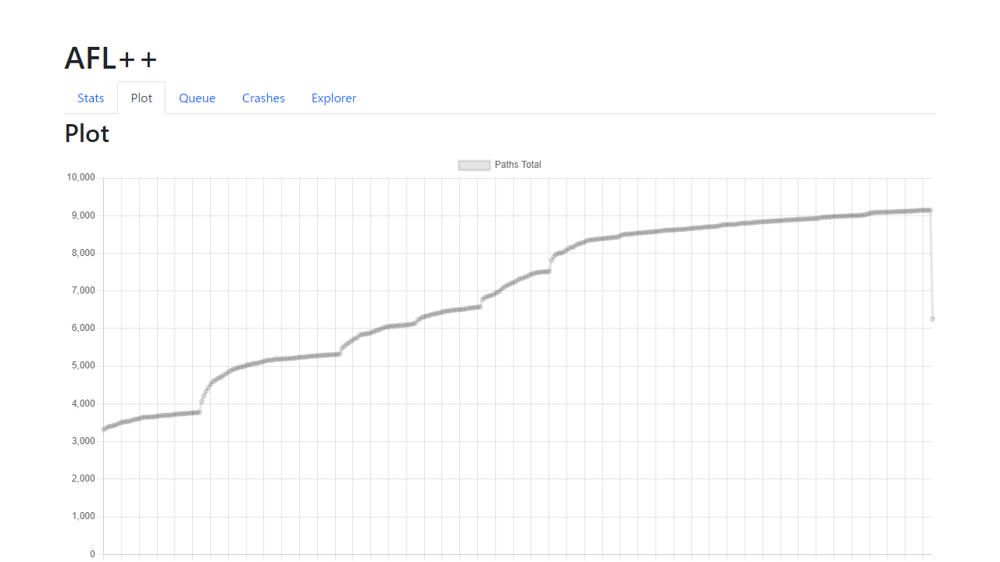
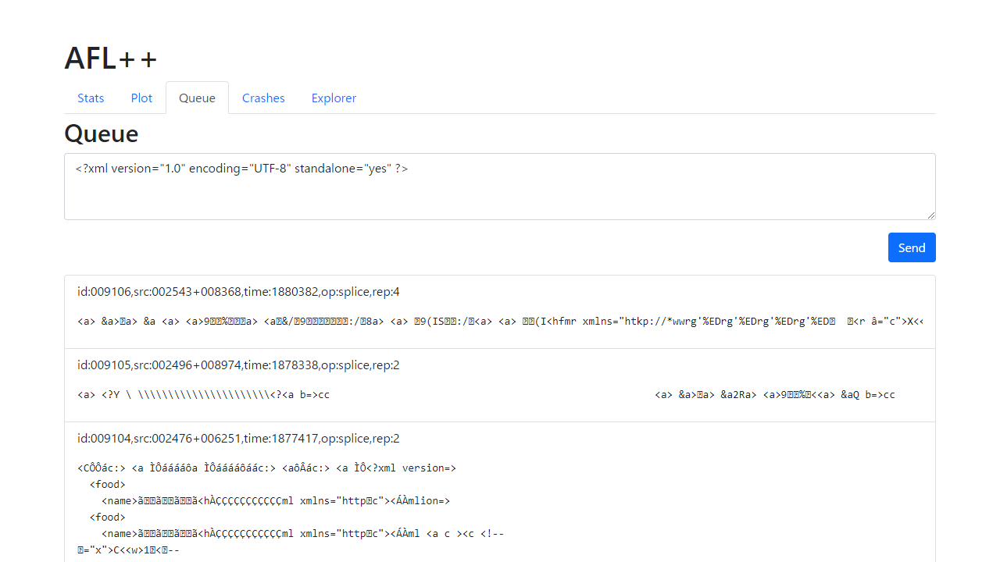
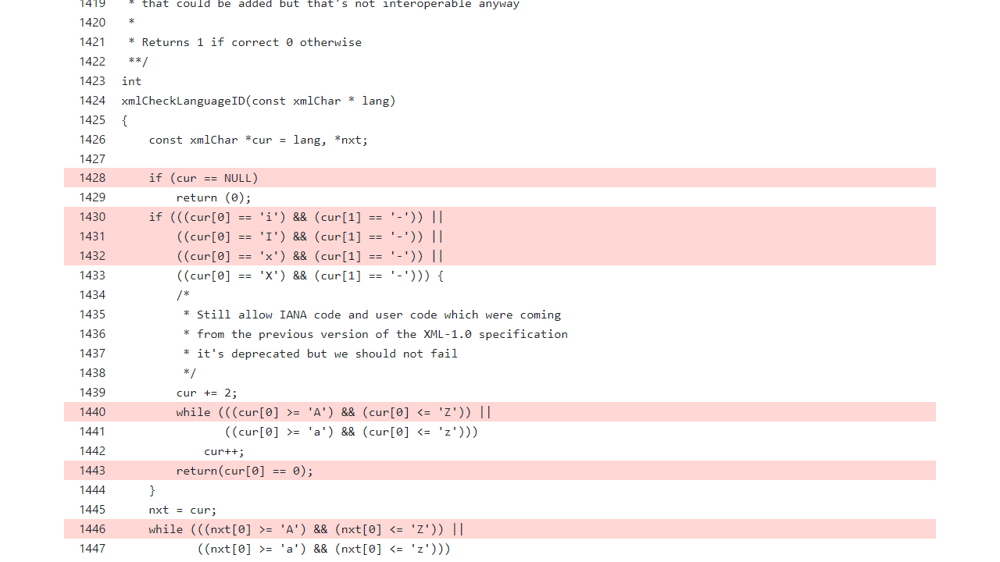

# sotsuron

This is an interactive fuzzing tool that visualizes code coverage of a fuzzing campaign and enables the debugger to intervene in the fuzzing queue.







## Prerequisites

- LLVM 11+
- npm

## Build

```sh
$ pushd AFLplusplus
$ make LLVM_CONFIG=llvm-config-13
$ popd

$ pushd cli
$ npm install
$ npm run build
$ npm link
$ popd
```

## Usage

### Instrumentation

Compile the program to be fuzzed using `aflv cc` / `aflv cxx`, which are equivalent to `afl-clang-lto` / `afl-clang-lto++` respectively.

```sh
$ aflv cc -o main main.c
```

The only difference is that `aflv cc` and `aflv cxx` generate a source map of the program in `.aflv/profile.json`.

### Fuzzing

Run `aflv fuzz`, which is equivalent to `afl-fuzz`.

```sh
$ aflv fuzz -i in -o out ./main
```

Then you can see the visualized progress on http://localhost:3000/.
